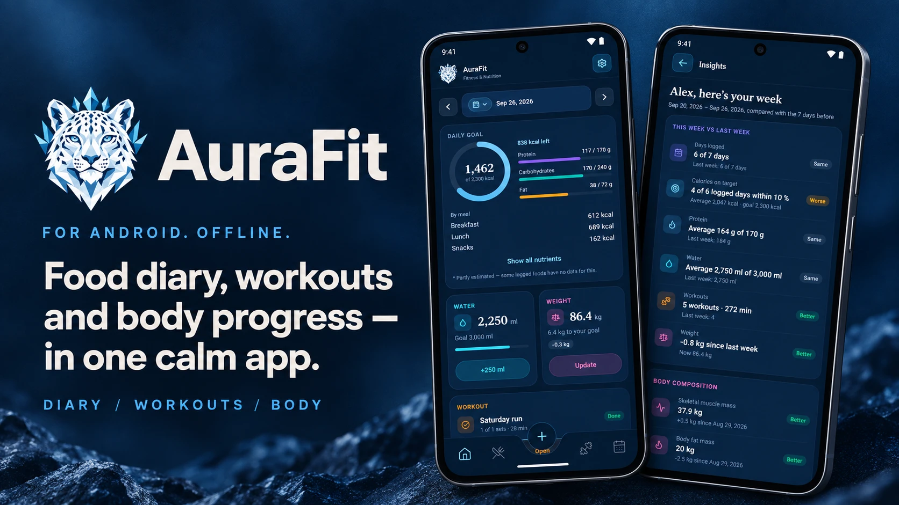

# AuraFit Marketing Gallery

A collection of promotional materials and assets for AuraFit — the calm fitness app for Android.

## Posters

### Main Marketing Poster

<div align="center">



**Download:** [Original Image](assets/gallery/poster.webp) | [Interactive HTML Version](assets/gallery/poster.html)

</div>

#### Poster Details

- **Format:** Vertical layout (optimal for mobile-first viewing)
- **Key Message:** "Food diary, workouts and body progress — in one calm app"
- **Design Focus:** 
  - Modern gradient background with icy blue tones matching the brand
  - App mockups showing real features (daily goal tracking, insights, body composition)
  - Snow leopard logo with ice-crystal crown
  - Professional typography emphasizing calm and clarity

#### Use Cases

- App store listings
- Social media campaigns
- Marketing websites
- Landing pages
- Digital advertisements
- Print materials (banner, flyer)

#### Color Palette

- **Primary Blue:** #4ABCE2 (icy cold)
- **Dark Background:** #0A1628, #1A3A52 (sophisticated, calm)
- **Accent:** Cyan and white for contrast and readability

---

## Asset Organization

```
assets/gallery/
├── poster.webp          # Original poster image
├── poster.html          # Interactive HTML version
└── README.md           # This file (optional detailed docs)
```

## HTML Poster Features

The `poster.html` file includes:

- ✨ Smooth animations and hover effects
- 📱 Fully responsive design (desktop, tablet, mobile)
- 🎨 Gradient backgrounds and modern UI
- 🔄 Floating mockup animations
- 📊 Interactive elements
- 🌙 Professional styling

### Customization

You can easily customize the HTML version by editing:

- Text content (heading, subtitle, buttons)
- Colors (update `#4abce2` and gradient values)
- Animation speeds (modify `animation` values)
- Button links (update `href` in CTA button)
- Feature tags (add/remove tags)

---

## Versioning

| Version | Date | Changes |
|---------|------|---------|
| 1.0 | 2026-09-29 | Initial poster creation with HTML recreation |

---

## Usage Guidelines

### ✅ Recommended Uses

- Download and share on social media platforms
- Embed on marketing websites
- Use in app store listings
- Print as promotional materials
- Include in press kits

### ⚠️ Best Practices

- Always include the AuraFit logo and brand colors
- Maintain the professional, calm aesthetic
- Ensure proper contrast for accessibility
- Test on mobile devices before publishing
- Credit Amer Alreyahi / AuraFit when sharing

---

## Contact & Licensing

For usage inquiries or licensing information, contact:
**Email:** amerzuher@outlook.com

© 2026 Amer Alreyahi. All rights reserved.
