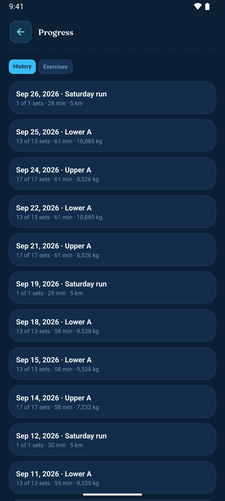
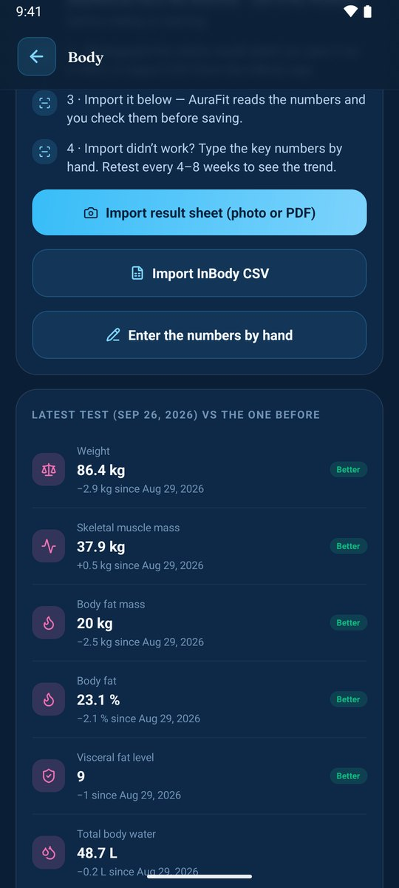
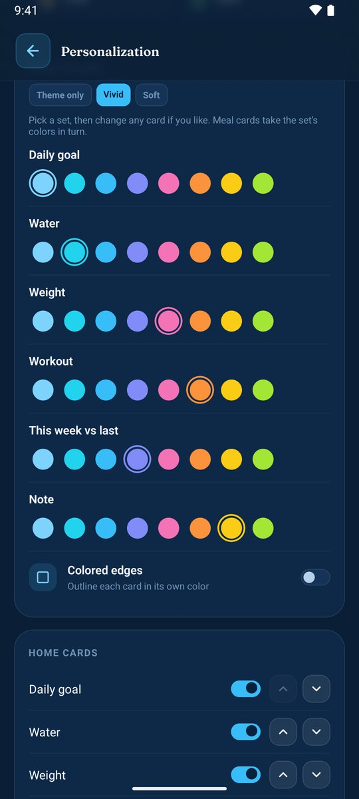
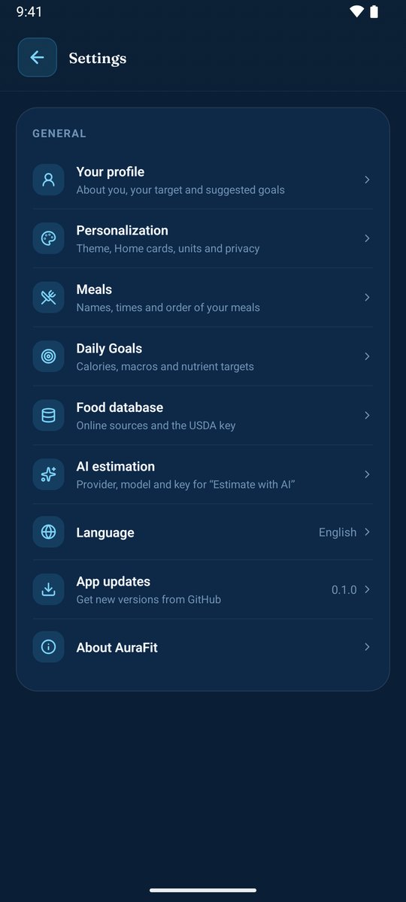
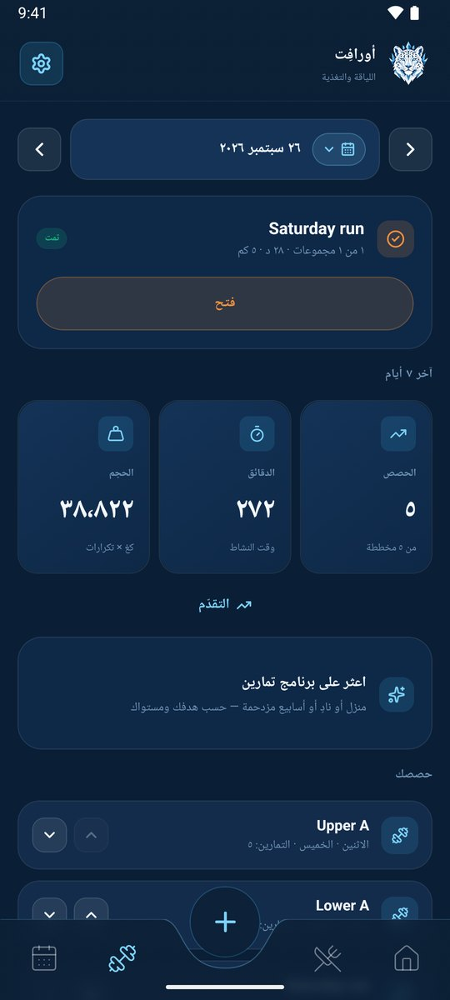
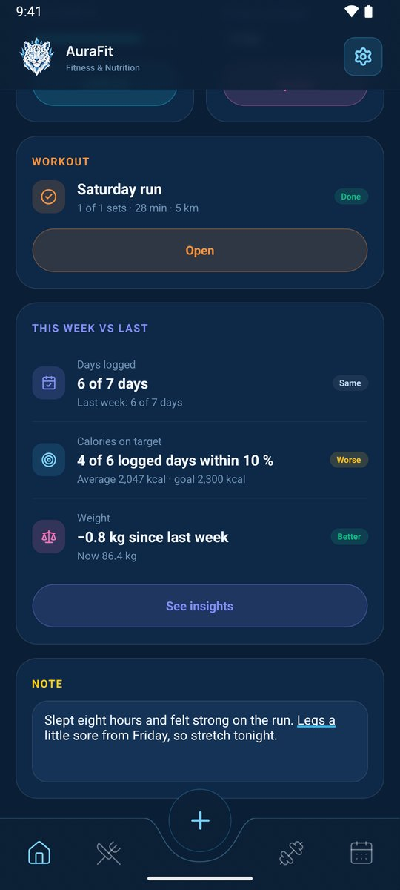

# AuraFit Media Gallery

Complete collection of screenshots, assets, and promotional materials for AuraFit — the calm fitness app for Android.

---

## 🎨 Brand Assets

### Logo

<div align="center">


**AuraFit Logo**  
Geometric snow leopard with ice-crystal crown

</div>

---

## 📱 App Screenshots

### Core Features

| | | |
|:---:|:---:|:---:|
|  |  |  |
| **Home** | **Meal Logs** | **Workout Log** |

### Planning & Progress

| | | |
|:---:|:---:|:---:|
|  |  |  |
| **Meal Plans** | **Workout Programs** | **Body Tracking** |

### Analytics & Insights

| | | |
|:---:|:---:|:---:|
|  |  |  |
| **Insights** | **Workout Progress** | **InBody Results** |

### Customization & Themes

| | | |
|:---:|:---:|:---:|
|  |  |  |
| **Light Theme** | **Card Colors** | **Settings** |

### Internationalization

| | |
|:---:|:---:|
|  |  |
| **Arabic (RTL)** | **Workout Arabic (RTL)** |

#### Week View

| |
|:---:|
|  |
| **Week View** |

---

## 🎯 Marketing Materials

### Main Poster

<div align="center">


**Download:** [Original Image](assets/gallery/poster.webp) | [Interactive HTML](assets/gallery/poster.html)

</div>

#### Poster Details

- **Design:** Modern gradient with icy blue tones
- **Format:** Vertical layout (mobile-optimized)
- **Key Message:** "Food diary, workouts and body progress — in one calm app"
- **Features Highlighted:**
  - Real app mockups with live data
  - Snow leopard brand logo
  - Feature highlights: Diary, Workouts, Body tracking
  - Offline-first positioning

#### Use Cases

- App store listings
- Social media campaigns
- Marketing websites
- Digital advertisements
- Print materials
- Landing pages

---

## 🎨 Color Palette & Design System

### Brand Colors

| Color | Hex | Usage |
|-------|-----|-------|
| **Primary Blue** | `#4ABCE2` | Accents, CTAs, highlights |
| **Dark Background** | `#0A1628` | Primary background |
| **Dark Accent** | `#1A3A52` | Secondary backgrounds |
| **Light Text** | `#FFFFFF` | Primary text |
| **Muted Text** | `#B0D4E3` | Secondary text |

### Design Principles

✨ **Calm & Clean** — Minimal, purposeful design  
❄️ **Icy Cold** — Cool blue tones reflecting the brand  
📱 **Mobile First** — Optimized for on-the-go use  
🌙 **Dark by Default** — Easy on the eyes  
🎨 **Highly Customizable** — 8 themes with light/dark variants  

---

## 📊 Screenshot Specifications

### Dimensions & Format

- **Format:** JPG (compressed for web)
- **Dimensions:** Typically 1080×2340px (mobile portrait)
- **Quality:** High resolution, sample data
- **Background:** Dark theme by default

### Featured Data Points

Screenshots include realistic sample data showing:
- Daily calorie tracking (1,462 kcal logged)
- Macro tracking (Protein, Carbs, Fat)
- Water intake logs
- Weight progress
- Workout sessions with sets
- Meal breakdown by category

---

## 📁 Asset Organization

```
assets/gallery/
├── logo.png                    # Brand logo
├── home.jpg                    # Home screen
├── home.jpg                    # Home (dark theme)
├── home-light.jpg              # Home (light theme)
├── home-week.jpg               # Week view
├── home-arabic.jpg             # Home (Arabic RTL)
├── meal-logs.jpg               # Meal logs list
├── meal-plan.jpg               # Meal planning
├── workout-log.jpg             # Workout logging
├── workout-programs.jpg        # Program finder
├── workout-progress.jpg        # Workout analytics
├── workout-arabic.jpg          # Workout (Arabic RTL)
├── body.jpg                    # Body tracking
├── body-inbody.jpg             # InBody results
├── insights.jpg                # Weekly insights
├── card-colors.jpg             # Customization
├── settings.jpg                # App settings
├── poster.webp                 # Marketing poster
└── poster.html                 # Interactive poster
```

---

## 🚀 Using These Assets

### For Developers

- Use for app store listings (Google Play)
- Include in README and documentation
- Share in technical blogs and articles
- Reference in API documentation

### For Marketing

- Social media posts and stories
- Marketing website banners
- Email campaigns
- Print advertisements
- Press kits and media packages

### For Documentation

- User guides and tutorials
- Feature demonstrations
- Before/after comparisons
- Usage examples

### Best Practices

✅ **Do:**
- Attribute AuraFit when sharing
- Include the brand logo in marketing
- Maintain professional presentation
- Test responsiveness across devices
- Credit Amer Alreyahi

❌ **Don't:**
- Alter brand colors without permission
- Remove watermarks or branding
- Use for competing products
- Misrepresent the app's features

---

## 📱 Version Information

| Version | Release Date | Changes |
|---------|------|---------|
| 1.1 | 2026-09-29 | Added comprehensive gallery with all screenshots |
| 1.0 | 2026-09-29 | Initial poster creation with HTML recreation |

---

## 📧 Contact & Licensing

For usage inquiries, partnerships, or licensing:

**Email:** amerzuher@outlook.com  
**GitHub:** [@AmerZuher](https://github.com/AmerZuher)

All assets © 2026 Amer Alreyahi. All rights reserved.

---

<sub>Screenshots use sample data and are representative of the app's capabilities.</sub>
