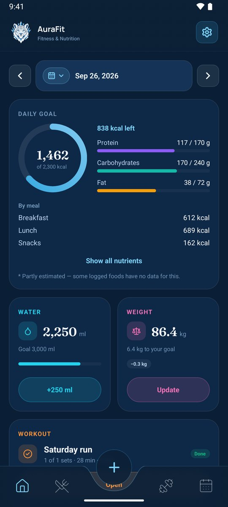
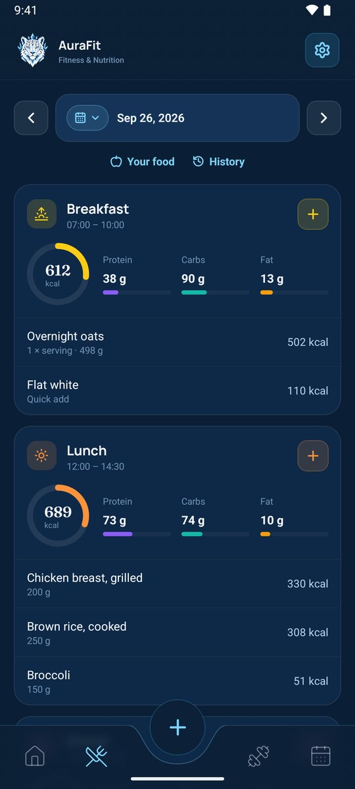
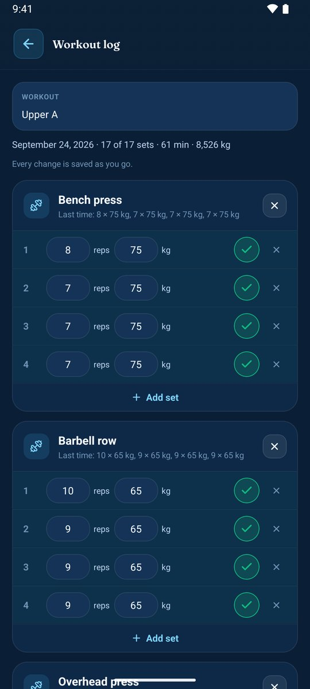
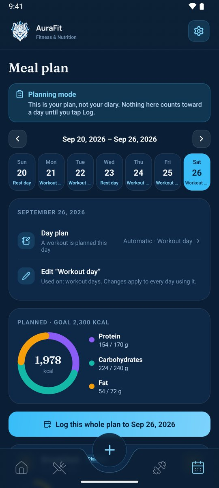
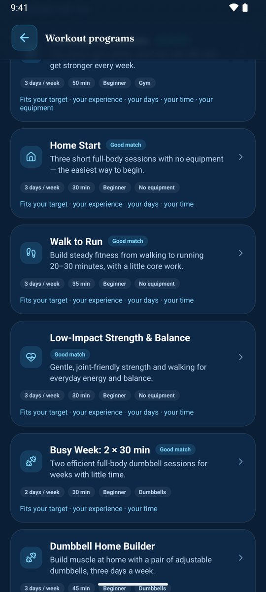
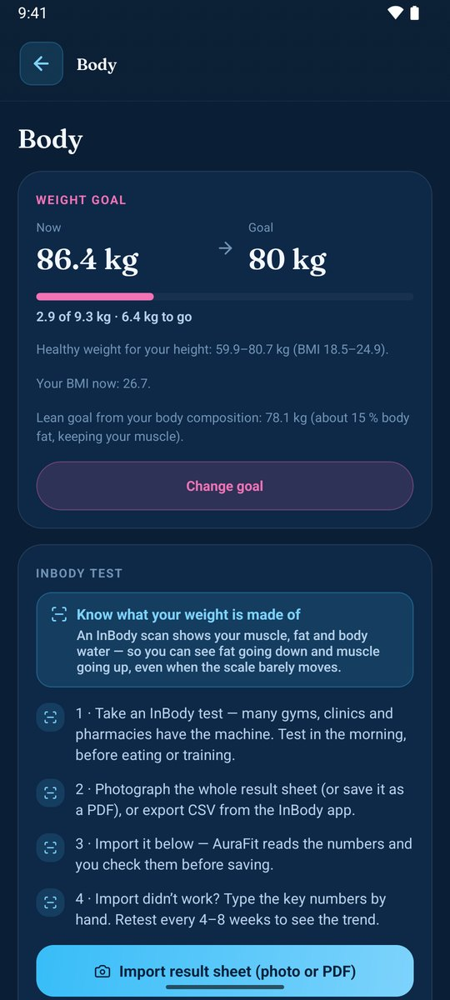
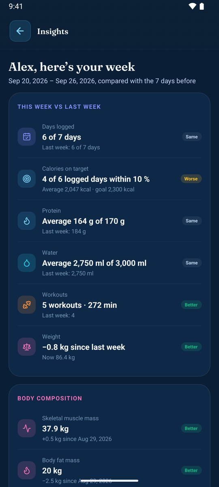
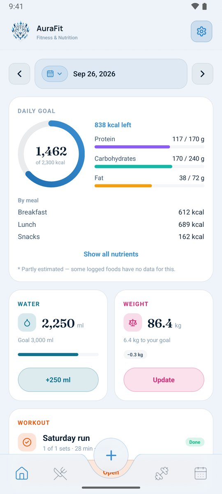
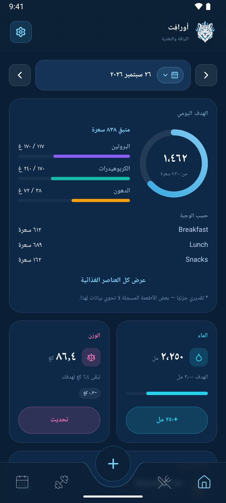

# AuraFit

**Food diary, workouts and body progress — in one calm app.**

For Android, in English and Arabic. Your diary stays on your phone.

## What you get

- 🍽️ **A food diary that's quick to fill.** Search Open Food Facts and USDA, scan a barcode, use your own foods and recipes, or snap a photo of your plate and let AuraFit AI estimate it. Meals can have their own calorie and macro targets, counted down as you eat.
- 🎯 **Goals that fit you.** Suggested calories, protein, carbs, fat and water from your age, height, weight, activity and target — used only if you choose. Different goals per weekday if you train on some days.
- 💪 **Workouts, set by set.** Plan workouts by weekday and log them with each set pre-filled from last time. Strength, timed and cardio, with history and best sets. 11 built-in programs, from home workouts to the gym, with a finder that picks one for you.
- 🌙 **Meal plans for real life.** Workout, rest, fasting (Iftar to Suhoor) and open days, each with its own meals and eating window. AuraFit AI can fill a day with local, home-style dishes. Log a whole day in one tap.
- 📈 **Progress you can trust.** This week vs. last for calories, protein, water, workouts, weight and body composition, InBody results compared test to test, and — with Health Connect — steps, activity and sleep. An optional AI coach turns your own numbers into tips and charts.
- 🎨 **Yours.** 8 themes, dark and light, card colors, kcal or kJ, and full Arabic with right-to-left layout.

## Screenshots

|                        Meal plan                         |                      Workout programs                       |                          Body                          |
| :------------------------------------------------------: | :---------------------------------------------------------: | :----------------------------------------------------: |
|  |  |  |
|                       **Insights**                       |                      **Light theme**                        |                  **العربية — Arabic**                  |
|  |  |  |

Screenshots use sample data.

## Plans

AuraFit is free. AI features (estimates, meal photos, the coach, InBody reading, meal plans) use monthly AI credits.

|                       | Free | Pro                       |
| --------------------- | :--: | :-----------------------: |
| Diary, workouts, meal plans, body, insights | ✓ | ✓ |
| AI credits every month | 60 | 1,000 |
| Cloud backup of your diary | — | ✓ |

Credits start over on the 1st of each month, and a failed AI answer costs nothing. Pro will be available through Google Play.

## Install

1. Open the [latest release](https://github.com/AmerZuher/aurafit-releases/releases/latest) on your phone and download **`auraFit_V….apk`**.
2. Open the file. If Android asks, allow your browser or file manager to install apps.
3. Accept the privacy policy and sign in with Google.

AuraFit updates itself from here: **Settings › App updates** (checked at most once a day, and every update is verified before it's installed). Already using AuraFit? Just install the new version over it — your data stays.

## Your privacy

- **Your diary stays on your phone.** Meals, workouts, body measurements, notes and settings are stored on your device, not on a server.
- **Your account holds very little:** your name, email, plan and how many AI credits you used this month.
- **AI sends only what it needs, only when you tap it** — and nothing about you beyond that.
- **No ads, no analytics, no tracking.** Your data is never sold.
- **Pro cloud backup** can be encrypted with a password only you know.

Read the full policy: [English](https://amerzuher.github.io/aurafit-releases/privacy/) · [العربية](https://amerzuher.github.io/aurafit-releases/privacy-ar/) · [Delete your account](https://amerzuher.github.io/aurafit-releases/delete-account/)

## Questions

<b>Why do I need to sign in?</b>

So your AI credits and plan follow you, and so Pro members can back up and restore their diary. Your diary itself never leaves your phone unless you use cloud backup.

<b>Does it work offline?</b>

Yes. Everything you log works offline. Only food search, AI features, cloud backup and signing in need a connection.

<b>I'm moving to a new phone.</b>

With Pro, sign in on the new phone and AuraFit offers your cloud backup. On Free, save a backup file in **Settings › Food database › Backup & restore** and restore it on the new phone.

<b>How do I delete my account?</b>

In the app: **Settings › Account › Delete account**. Without the app: [see here](https://amerzuher.github.io/aurafit-releases/delete-account/).

## What's new

Each version's changes are in its [release notes](https://github.com/AmerZuher/aurafit-releases/releases).

## Help and feedback

- **Found a problem or have an idea?** [Open an issue](https://github.com/AmerZuher/aurafit-releases/issues/new/choose) — there's a short form for each.
- **About your account, subscription or privacy?** Email **amerzuher@outlook.com** (not a public page).

---

Nutrition figures and suggested goals are estimates from food labels, databases and standard formulas, not medical advice. Talk to a professional about your diet and training. · © 2026 Amer Alreyahi
